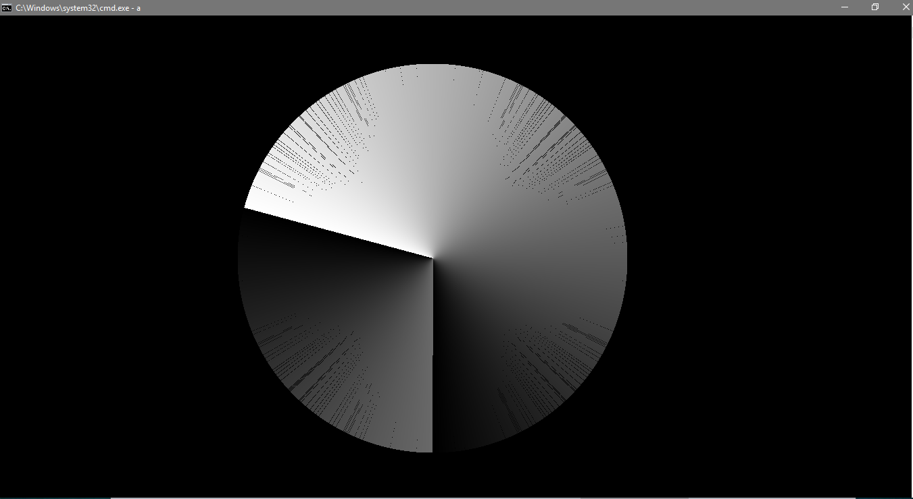
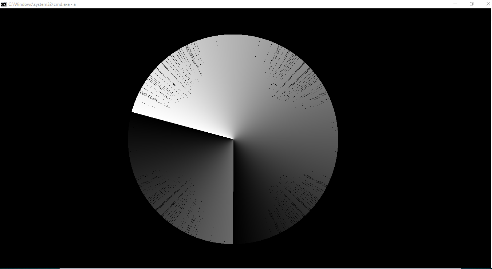
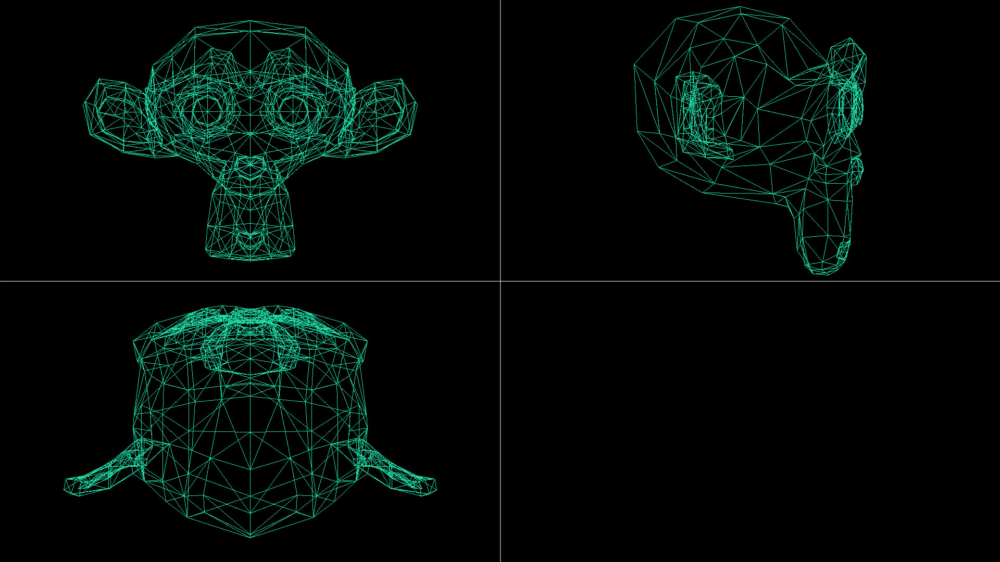
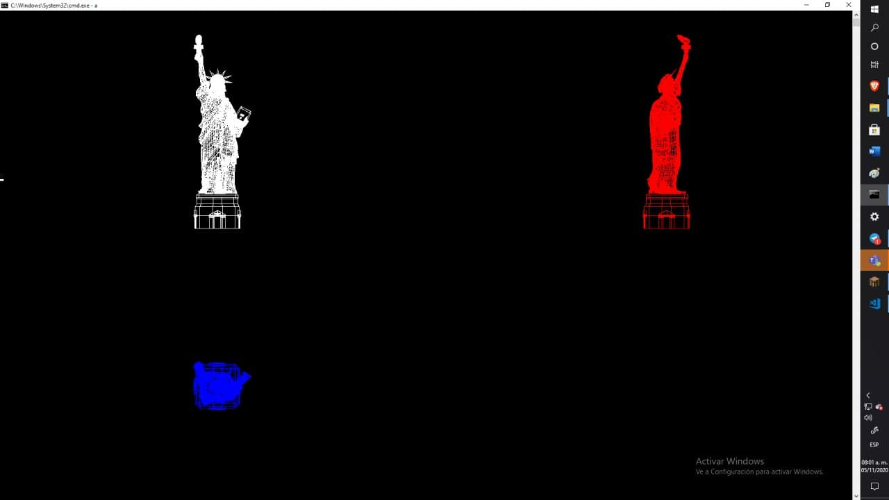
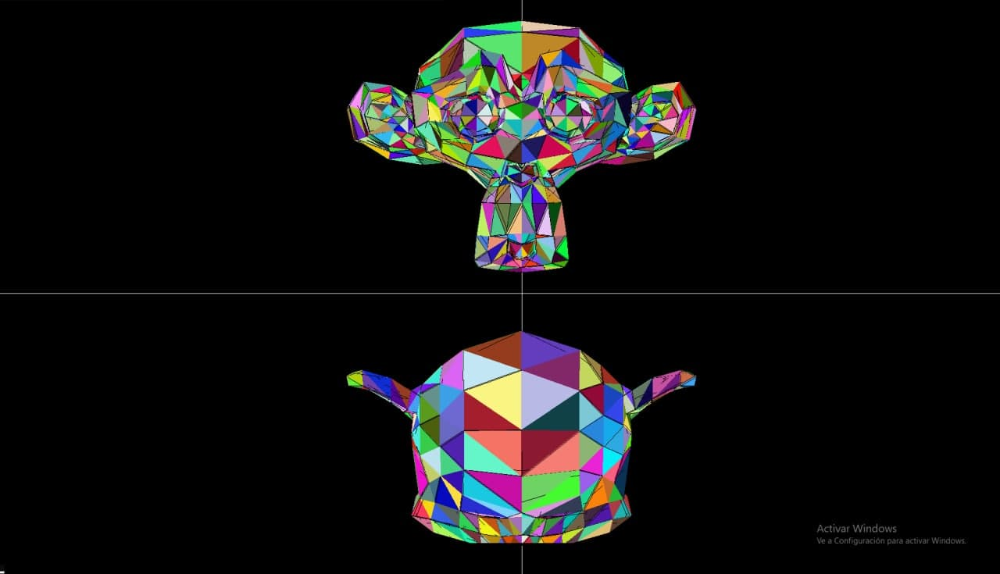
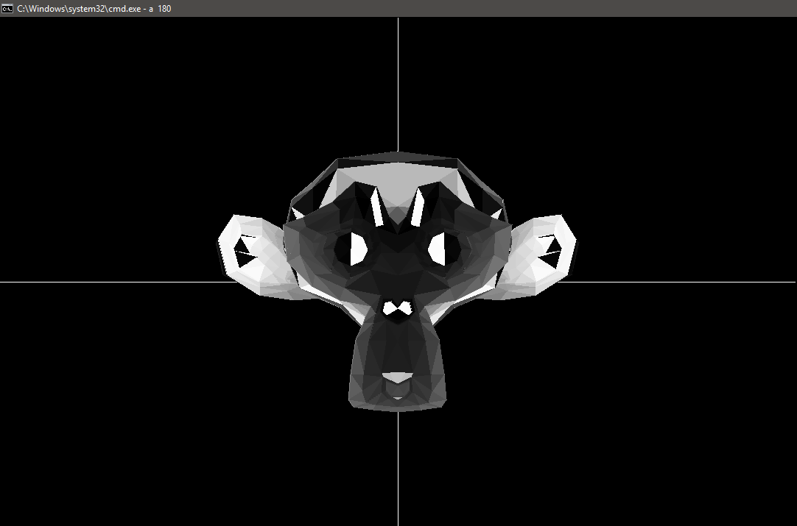
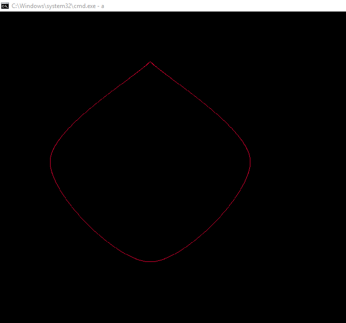

# ComputerGrafics

## *Juan Carlos Alvarez Velázquez*

## Line Drawing DDA 

## Line Drawing Bresenham 

## OBJ with Monkey 

## OBJ with Test 

## VLF with Zbuffer

## VLF with Illumination

## Cubic Hermite Interpolation

